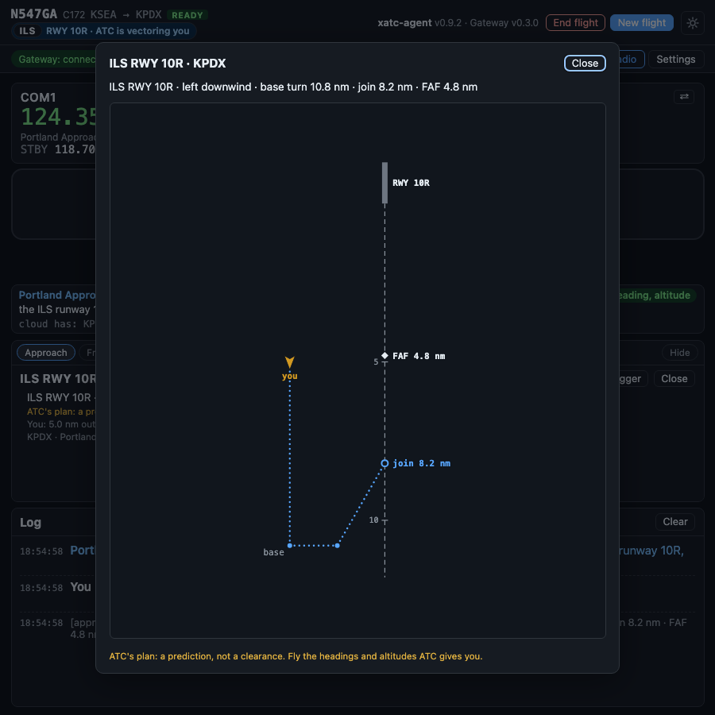

# The approach plan

When ATC vectors you for an approach, you fly one heading at a time. The window shows you the whole plan: where ATC means to take you, and where you are on it.

## The confirmation in the header

While ATC has you on an approach, the top line of the window says so, beside your callsign:

| You see | It means |
|---|---|
| **ILS** · RWY 10R · ATC is vectoring you (blue) | ATC has a plan for you and is calling each turn. You do not need to ask for vectors |
| **ILS** · RWY 10R · cleared for the approach (green) | ATC has cleared you for the approach |

The badge is the kind of approach: **ILS**, **RNAV**, **Visual**, or another kind by its name, such as **LOC**.

It shows in both views, whatever card is in the card slot.

## The Approach card

*ATC's plan for a vectored ILS, full size: a left downwind, the base turn at 10.8 nm, joining the final at 8.2 nm, outside the final approach fix.*

The diagram is drawn **course up**: the runway is at the top and the final approach course runs down the page.

- **The runway** and the extended centerline, with a tick every 5 nm.
- **The final approach fix**, with its name (when the data has one) and its distance from the runway.
- **Where you join the final**, with its distance.
- **The path ATC plans**, as a dotted line: the downwind, the base turn, the turn to final.
- **Your aircraft**, turned to its heading.

Beside the diagram:

- the plan in one line: "ILS RWY 10R · left downwind · base turn 10.8 nm · join 8.2 nm · FAF 4.8 nm",
- where you are: "You: 5.0 nm out, 3.0 nm left of the final",
- the airport, the controller and your assigned altitude,
- the badge: **vectors**, then **cleared**.

!!! warning "A prediction, not a clearance"
    The card shows ATC's plan. It changes as ATC changes it. Fly the headings and altitudes ATC gives you on the radio, not the picture.

## Reading it

- **Far from the airport**, your aircraft sits at the edge of the diagram with its distance, and an arrow points to where it really is. The plan stays large enough to read.
- **Without X-Plane connected**, the plan still shows, and the card says your position is not known.
- **As you fly the pattern**, the parts behind you drop off, and the dotted line always starts at your aircraft.

## Bigger

The card slot is small. **Bigger** opens the diagram in the full window, and **Close**, Esc or a click outside it closes it again.

If the window is too short for the card's diagram to be readable, the full-size diagram **opens by itself** when ATC's plan starts. It does so once per approach: after you close it, ATC's updates do not bring it back. Holding **Space** still transmits while it is open.

## Turning it off

- **Close** on the card hides it until ATC plans a different approach.
- **Settings > Display > Show the Approach card** turns the card off for good. The confirmation in the header stays.
