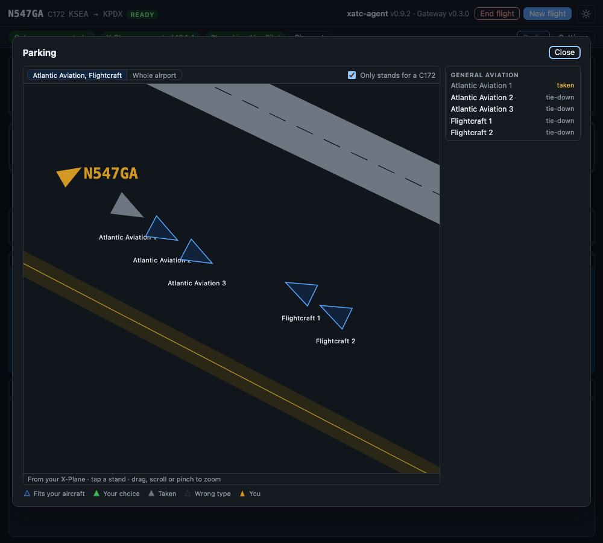

# Parking

When ATC asks you to **"say parking"**, the window shows what you can answer.

It happens with Approach at a large airport, with Tower after you leave the runway, or with Ground on the taxi-in. The Parking card comes to the front of the card slot.

## What you can say

- **Names**, as big buttons first: "Atlantic Aviation", "FBO", "GA". These are the names a pilot would say on the radio.
- **Gates and stands**, grouped by kind: airline gates by concourse, general aviation, cargo, and the rest. A large airport gets a search box.

Tap one and the card copies the words to say: "parking Atlantic Aviation". Then say them on the radio. Picking something in the window sends nothing to ATC: you still ask by voice.

The card goes away once ATC has your parking, when the flight ends, or with **Close**.

## The parking map

*The parking map, opened full size, on demo scenery: the stands that fit a C172, one of them taken, and your own aircraft taxiing in.*

Above the lists, the card draws your destination from your own X-Plane scenery:

- the **runways** with their numbers and the **taxiways** with their letters,
- every **stand** as an arrow pointing the way the nose goes,
- **your aircraft**, when you are at or near the airport.

Stands that take your kind of aircraft (piston, turboprop, jet or heavy jet, as the scenery lists them) are blue. **Only stands for** your type, on by default, hides the others. A stand that another aircraft in your X-Plane is sitting on is grey and says **taken**. You can still pick it, and ATC may tell you it is occupied.

Drag, scroll or pinch to zoom; stand names appear once you are zoomed in. The buttons above the map jump to the ramps that have stands for you. **Bigger map** opens it in the full window.

Tap a stand, on the map or in the list, and the card shows its name, its kind, whether it is free, and the words to say, with **Copy the words**.

Everything on the map comes from the X-Plane files on your PC and works offline.

## What Ground does with it

- A parking you name is where the taxi-in ends: a gate, an FBO by name, or "general aviation".
- Name nothing and Ground picks a general parking for you.
- If Ground cannot find what you named, it says so and taxis you somewhere sensible.
