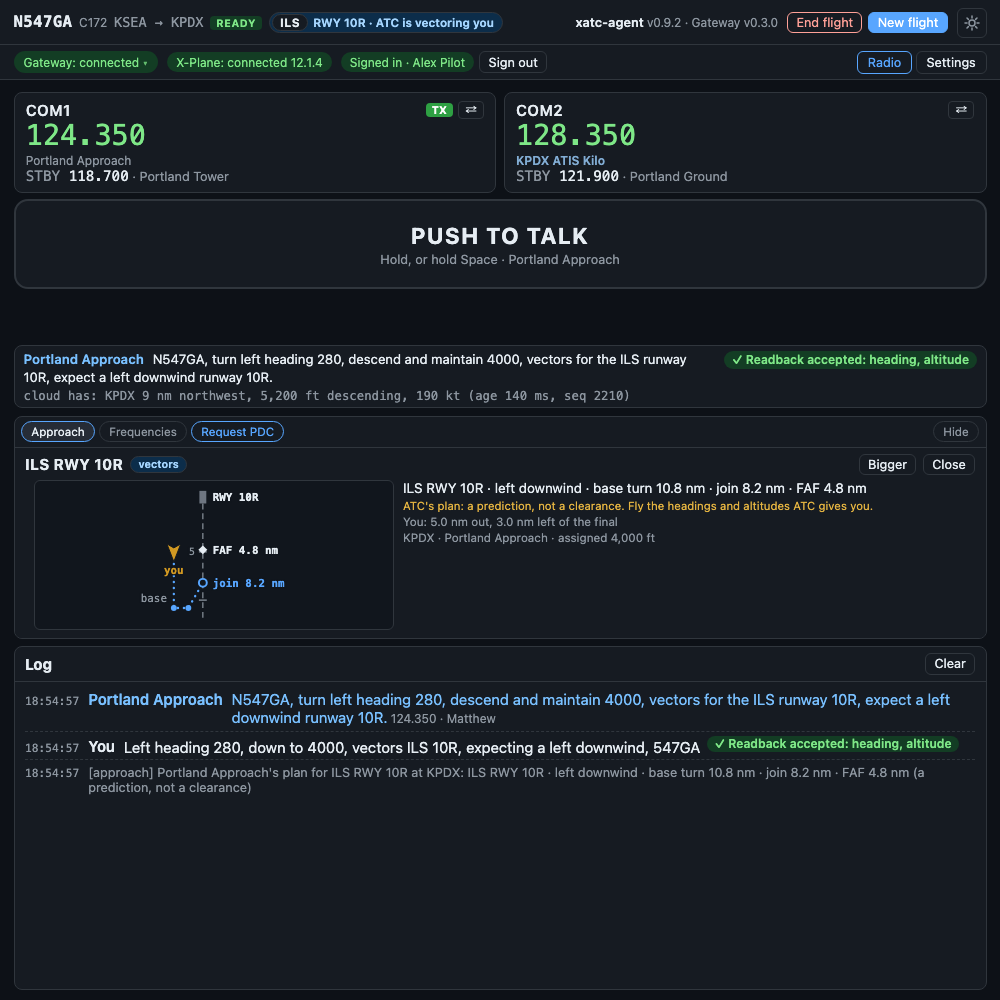

# xatc-agent

**AI air traffic control for X-Plane 12.** You hold push-to-talk and speak as you would on a real radio. A controller answers in US FAA phraseology, on the frequency you are tuned to, from the gate at one airport to the gate at the next.

*The window beside X-Plane, while Approach is vectoring the flight for an ILS: the radios as X-Plane has them, push-to-talk, ATC's plan for the approach, and the log of what was said.*

## What it does

- **Every position talks to you.** Clearance Delivery, Ground, Tower, Departure, Center and Approach, each on its real frequency. Tune a frequency nobody is on and you hear nothing, as on a real radio.
- **Real procedures.** IFR clearances, taxi routes with hold-short instructions, takeoff and landing clearances, climbs and descents, SIDs and STARs, vectors to an ILS, RNAV or visual approach, and handoffs between controllers.
- **ATC calls you too.** Handoffs, a readback you forgot, an altitude you drifted from, traffic, a go-around: the controller speaks first when a real one would.
- **Readbacks are checked.** A correct readback gets silence and a check mark in the window. A wrong one is corrected: "negative, squawk six six six two".
- **Any US airport**, from the FAA's own data: procedures, frequencies, airspace and minimum altitudes. Taxiways and parking come from your own X-Plane scenery, so Ground taxis you on the airport you actually see.
- **A window that helps.** The frequency to tune next, what ATC is still waiting for you to read back, ATC's plan for your approach as a diagram, and your destination's parking on a map.

See [What ATC can do](features/index.md) for the full list, position by position.

## What a flight is like

1. Start X-Plane 12 and the xatc-agent window. Press **New flight** and enter your flight plan, or load it from SimBrief.
2. Tune the ATIS and listen. Then call Clearance Delivery: *"Seattle Clearance, November five four seven Golf Alpha, IFR to Portland with information Charlie."* You get your clearance and read it back.
3. Ground taxis you to the runway. Tower clears you for takeoff. Departure climbs you and puts you on course. Center takes you to cruise and brings you down again.
4. Approach vectors you to final and clears the approach. Tower clears you to land and tells you where to leave the runway. Ground taxis you to the parking you ask for.

[Your first flight](first-flight.md) walks through it step by step.

## What you need

- X-Plane 12 on Windows 10 or 11, and a microphone.
- An xatc-agent account. The project is an invitation-only experiment: the owner creates your account and gives you the client.
- An internet connection during the flight. The controller runs in the cloud; the window beside X-Plane is a thin client.

[Install and sign in](getting-started.md) has the details.

## Know before you fly

!!! warning "A simulation, and an experiment"
    xatc-agent is for flight simulation only. It is not a training device and must never be used for real-world flying. It is under active development: what a controller says and does changes between releases, and things break.

- **IFR only**, for now. VFR departures, pattern work and flight following are not built.
- **US airports** work best: everything outside the taxiways comes from the FAA's data. Outside the US, ATC asks your X-Plane for the airport's procedures and frequencies instead.
- **English, FAA phraseology.**
- When ATC is asked for something it has not been taught, it says so: *"unable, I have not completed that training."* It does not make something up.
