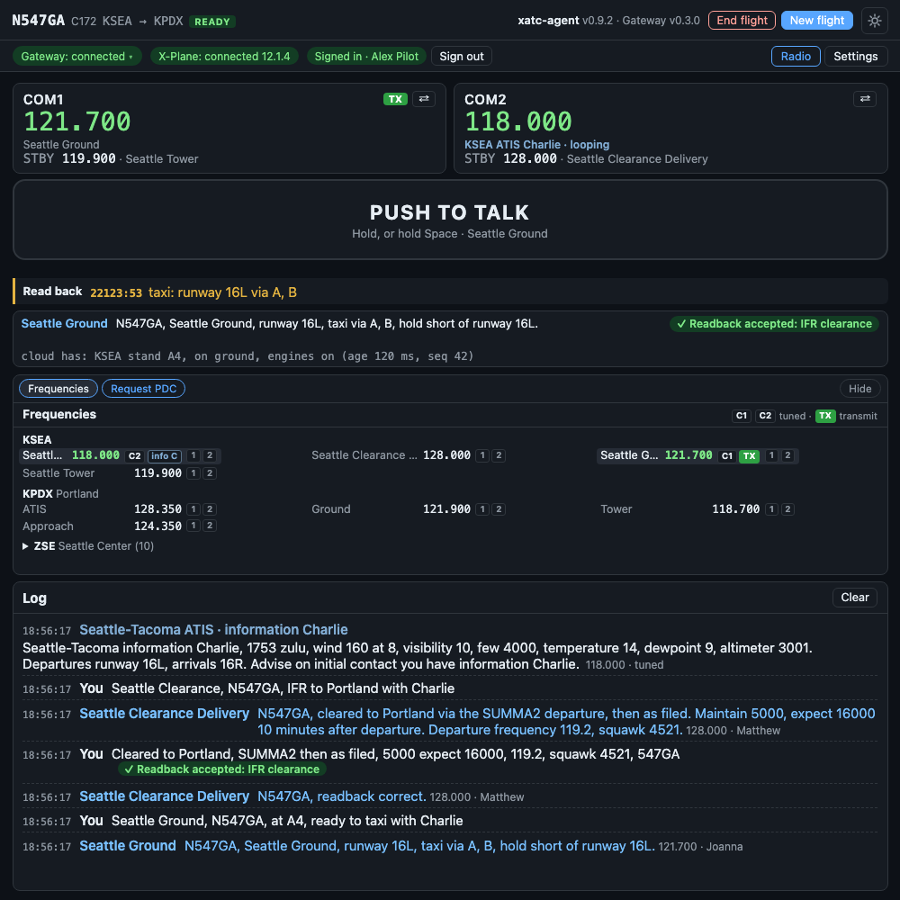

# The window

The client runs in its own window, titled **xatc-agent**, beside X-Plane. It has two views, **Radio** and **Settings**. This page is a tour of the Radio view, from the top.

*On the ground at Seattle, just after Ground's taxi instruction: the **Read back** line shows what ATC is waiting for.*

## The header

- **Your flight**: callsign, aircraft type, departure → destination, and its state (starting, ready, ended). With no flight it says "No flight: press New flight". When a flight ended, the line under it says why.
- **The approach confirmation**: while ATC has you on an approach, a pill beside your callsign shows the kind of approach (**ILS**, **RNAV**, **Visual**), the runway, and **ATC is vectoring you**. It turns green and says **cleared for the approach** once ATC clears you. See [The approach plan](client/approach-card.md).
- **End flight** (only while a flight runs) and **New flight**.
- The client's version and the gateway's version, and the light/dark theme button.

## The services row

Three pills show what the client is connected to:

| Pill | What it shows |
|---|---|
| **Gateway** | The connection to ATC. Click it for the reason of the last change and **Reconnect**, which reopens the connection on the same flight |
| **X-Plane** | Connected or not. It turns amber and reads **X-Plane: paused** while the sim is paused: ATC is silent then and does not hear you |
| **Sign-in** | Green when signed in, red when not (with **Sign in**), amber when signed in but the sign-in service cannot be reached |

## The radios

**COM1** and **COM2**, active and standby, exactly as X-Plane has them, with the name of the facility on each frequency when ATC knows it ("Seattle Ground").

- **TX** marks the radio selected to transmit on your aircraft's audio panel. It turns red while you transmit.
- **⇄** swaps active and standby, like the flip-flop key on a real radio.
- A radio tuned to an ATIS says so: "KSEA ATIS Charlie · looping".

The client changes X-Plane's radios and nothing else, so the window always shows what X-Plane really has.

## Push-to-talk

The big button. Press and hold to transmit, release to stop. Its hint names the facility you are transmitting to. It works with a mouse or a touch screen, and holding **Space** does the same while the window has focus. If the window loses focus the button releases, so the radio cannot get stuck keyed.

For a button on your yoke or joystick, see [Settings](settings.md#push-to-talk).

## Read back, and Next

Under push-to-talk:

- **Read back**: what ATC is still waiting for you to read back, with how long it has waited. It empties when your readback is accepted.
- **Next**: after a handoff ("contact Portland Approach one two four point three five") it shows **Next: Portland Approach 124.350** with **COM1** and **COM2** buttons. They put the frequency in that radio's standby; then press **⇄**.

## Last ATC

Who spoke last and what they said, with the verdict on your last readback: **✓ Readback accepted** or **✗ Corrected**. Numbers are shown as you would write them ("119.2"), while the audio says them as a controller does ("one one niner point two").

## The card slot

One card at a time, picked with the chips above it. The slot keeps its height, so the log below never jumps.

| Card | When it shows |
|---|---|
| **Frequencies** | Always available: the ATC stations for your flight |
| **[Approach](client/approach-card.md)** | When ATC starts vectoring you for an approach |
| **[Parking](client/parking.md)** | When ATC asks you to say your parking |
| **[PDC](client/pdc.md)** | After you request a pre-departure clearance by text |
| **Pilot deviation** | When ATC flags a deviation, such as taking off without a clearance. It stays until you dismiss it |
| **Unable to access data** | When ATC cannot read its airport data. The client pauses X-Plane; see [Troubleshooting](troubleshooting.md#unable-to-access-data-check-connection) |

An alert takes the front and its chip turns amber. **Hide** folds the slot down to its chips.

### Frequencies

The stations ATC has for your flight, grouped by airport, your departure and destination first. **C1** and **C2** mark what COM1 and COM2 are tuned to, **TX** the one you transmit on, and each ATIS shows its current letter.

Each station has two small buttons, **1** and **2**: they put its frequency into COM1's or COM2's standby. Then press that radio's **⇄**. The list follows the flight: when a clearance or a handoff names another frequency, the card changes with it.

## The log

Everything that happened, newest at the bottom:

- **You**: what the speech recognition heard, in grey while it is still working. A correct readback gets silence on the radio, so the verdict appears here: a green **✓ Readback accepted** or an amber **✗ Corrected**.
- **ATC**: the station, what it said and the frequency. If you were not tuned to it, the next line says it was not played.
- **No reply**: why ATC did not answer. See [Troubleshooting](troubleshooting.md#atc-does-not-answer).
- **Timing**: how long each step of the reply took.

Scroll up to read something and the log stays where you left it; scroll back to the bottom and it follows again.

## Dialogs you will meet

- **The startup dialog**, each time the client starts: your sign-in, the gateway and X-Plane. It closes by itself when the first two are ready. After a client restart mid-flight it offers **Rejoin last flight**.
- **New flight**: the flight plan, by hand or from SimBrief.
- **The recording question**, the first time you connect: see [Your data](privacy.md#recordings-of-your-voice).
- **The approach diagram**, full size, when ATC's plan starts and the card is too small to read.
